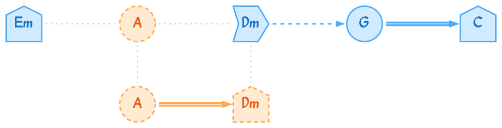
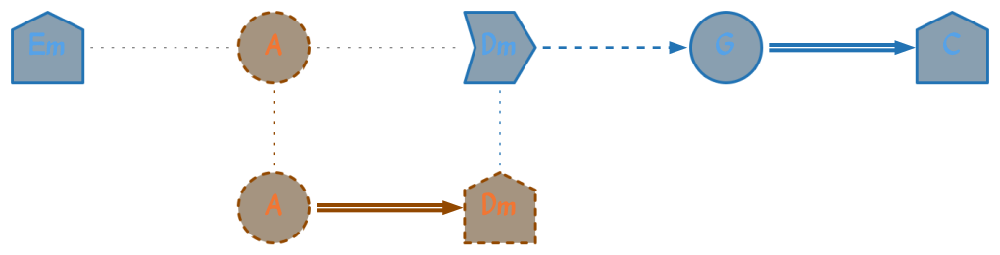

<h1 align="center">Tonalogy API</h1>

<p align="center">
  A powerful API for harmonic progression analysis and tonal structure visualization using modal logic and Kripke structures.
</p>

<p align="center">
  
</p>

## 📜 About The Project

**Tonalogy API** is a tool for musicians, students, and music theory researchers. It takes a sequence of chords and, using a model based on Kripke structures, analyzes the possible tonalities and the stability of the harmonic progression. Its key feature is the ability to not only analyze but also **generate elegant and informative vector visualizations (SVG)** of the harmonic path, making complex music theory concepts much easier to understand.

> **Academic Context:** This system is the practical implementation of the undergraduate thesis entitled:
>
> *"A Computational Implementation for Tonality Analysis in Harmonic Progressions via Possible Worlds Semantics"*
>
> *Universidade Federal do Ceará – Campus Quixadá*
>
> It serves as the applied component of this research, transforming a theoretical model into a practical software solution for tonal inference and musical interpretation. For a deeper dive into the theoretical foundations, you can [read the preliminary thesis document here](./docs/tcc1_ajamorais.pdf).

### ✨ Features

-   **Harmonic Analysis:** Evaluates chord progressions to determine their tonal characteristics.
-   **Kripke Model:** Uses modal logic to model the "possible worlds" of a harmonic progression.
-   **Graphic Visualization:** Generates PNG graphs that represent the tonal journey of the chords.
-   **Dark & Light Themes:** Support for both light and dark visualization themes with automatic color adaptation.
-   **RESTful API:** A simple, HTTP-based interface for easy integration with other applications.

### 🛠️ Tech Stack

-   [Python 3.11+](https://www.python.org/)
-   [FastAPI](https://fastapi.tiangolo.com/)
-   [Pydantic](https://docs.pydantic.dev/)
-   [Graphviz](https://graphviz.org/) for graph rendering.
-   [Pytest](https://docs.pytest.org/) for testing.

---

## 🚀 Getting Started

Follow these instructions to get a copy of the project up and running on your local machine.

### ✅ Prerequisites

-   Python 3.9 or higher
-   A package manager like `pip`
-   Graphviz system package (e.g., `sudo apt-get install graphviz` on Debian/Ubuntu)

### ⚙️ Installation

1.  **Clone the repository**
    ```sh
    git clone https://github.com/joabemorais/tonalogy-api.git
    ```

2.  **Navigate to the project directory**
    ```sh
    cd tonalogy-api
    ```

3.  **(Recommended) Create and activate a virtual environment**
    ```sh
    python -m venv .venv
    source .venv/bin/activate  # On Windows, use `.venv\Scripts\activate`
    ```

4.  **Install the project**
    
    **For production use:**
    ```sh
    pip install .
    ```
    
    **For development:**
    ```sh
    pip install -e ".[dev]"
    ```
    
    **Alternative using requirements.txt:**
    ```sh
    # Production
    pip install -r requirements.txt
    
    # Development
    pip install -r requirements-dev.txt
    ```

### 🏃 Running the Application

**Method 1: Using the installed script (recommended)**
```sh
# After installing with pip install .
tonalogy-api
```

**Method 2: Using uvicorn directly**
```sh
uvicorn api.main:app --reload --host 0.0.0.0 --port 8000
```

**Method 3: Using Python directly**
```sh
python api/main.py
```

The server will be available at `http://localhost:8000`.

### 📖 API Documentation

Once the server is running, visit:
- **Interactive API docs (Swagger UI)**: `http://localhost:8000/docs`
- **Alternative API docs (ReDoc)**: `http://localhost:8000/redoc`

### 🧪 Running Tests

```sh
# Run all tests
pytest

# Run tests with coverage
pytest --cov=api --cov=core --cov=visualizer

# Run specific test categories
pytest -m unit          # Unit tests only
pytest -m integration   # Integration tests only
```

### 🔧 Development Tools

**Code formatting:**
```sh
black .                 # Format code
isort .                 # Sort imports
```

**Type checking:**
```sh
mypy .                  # Check types
```

**All quality checks:**
```sh
black . && isort . && mypy . && pytest
```

---

## 💡 Usage

You can interact with the API using any HTTP client. Here are some examples with `curl`.

### 1. Analyze a Progression

Send a list of chords to the `/analyze` endpoint to receive a detailed analysis.

**Request:**
```sh
curl -X 'POST' \
  'http://localhost:8000/analyze' \
  -H 'accept: application/json' \
  -H 'Content-Type: application/json' \
  -d '{
  "chords": [
    "Em",
    "A",
    "Dm",
    "G",
    "C"
  ],
  "tonalities_to_test": []
}'
```

**Expected Response:**
```json
{
  "is_tonal_progression": true,
  "identified_tonality": "C Major",
  "explanation_details": [
    {
      "formal_rule_applied": "Analysis Start",
      "observation": "Testing progression with primary tonality: 'C Major'.",
      "processed_chord": null,
      "tonality_used_in_step": "C Major",
      "evaluated_functional_state": null
    },
    // ... rest of the analysis
  ]
}
```

### 2. Generate a Visualization

Send a list of chords to `/visualize` to generate a PNG graph of the analysis.

**Request (Light Theme - Default):**
```sh
curl -X 'POST' \
  'http://localhost:8000/visualize' \
  -H 'accept: application/json' \
  -H 'Content-Type: application/json' \
  -d '{
  "chords": [
    "Em",
    "A",
    "Dm",
    "G",
    "C"
  ],
  "tonalities_to_test": [],
  "theme": "light"
}'
```

**Request (Dark Theme):**
```sh
curl -X 'POST' \
  'http://localhost:8000/visualize' \
  -H 'accept: application/json' \
  -H 'Content-Type: application/json' \
  -d '{
  "chords": [
    "Em",
    "A",
    "Dm",
    "G",
    "C"
  ],
  "tonalities_to_test": [],
  "theme": "dark"
}'
```

**Expected Response:**
Image of the generated PNG graph. No JSON, just the png file, as shown below:



... Or in the dark theme:



### 🎨 Visualization Themes

The API supports both light and dark themes for visualizations:

- **Light Theme (default)**: Clean background with darker elements, ideal for documents and presentations
- **Dark Theme**: Dark background with bright elements, perfect for modern interfaces and reduced eye strain

**Theme Parameter:**
- `"light"` - Light theme (default if not specified)
- `"dark"` - Dark theme

The theme affects all visual elements including:
- Background colors
- Node colors (automatically adjusted per tonality)
- Edge colors and connecting lines
- Text labels


### 📚 Interactive API Documentation

For a complete experience, including testing endpoints directly from your browser, access the documentation automatically generated by FastAPI:

-   **Swagger UI:** [http://localhost:8000/docs](http://localhost:8000/docs)
-   **ReDoc:** [http://localhost:8000/redoc](http://localhost:8000/redoc)

---

## 🧪 Running the Tests

To ensure code integrity and validate new features, run the test suite with Pytest.

```sh
pytest
```

---

## 🤝 Contributing

Contributions are what make the open-source community such an amazing place to learn, inspire, and create. Any contributions you make are **greatly appreciated**.

1.  **Fork** the Project.
2.  Create your Feature **Branch** (`git checkout -b feature/AmazingFeature`).
3.  **Commit** your Changes (`git commit -m 'Add some AmazingFeature'`).
4.  **Push** to the Branch (`git push origin feature/AmazingFeature`).
5.  Open a **Pull Request**.

---

## 📄 License

This project is licensed under the **Business Source License 1.1**.

Under this license, you may use the software for non-production purposes. On **August 14, 2029**, the license will automatically convert to the **Apache License, Version 2.0**.

Please see the `LICENSE.md` file for the full terms.

---

## 📬 Contact

Joabe Morais - [LinkedIn](https://www.linkedin.com/in/joabemorais/) - [Github](https://github.com/joabemorais)
